# MeguClock product?

In this project, I'll try to learn how to design PCB and reverse engineer the connections of the components.

What I've learned when making this project:

1. Logic Level Shifter (ts makes my head hurt)
2. Power filtering (High, Low Frequency)
3. Decoupling?!?
4. RC Low Pass Filter lmao

## [REVISION 1]
tests:

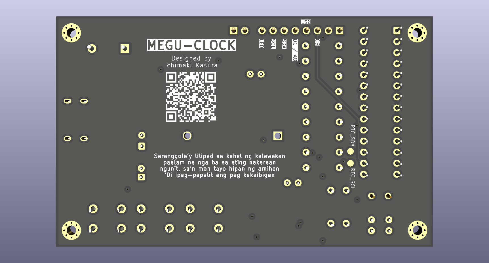
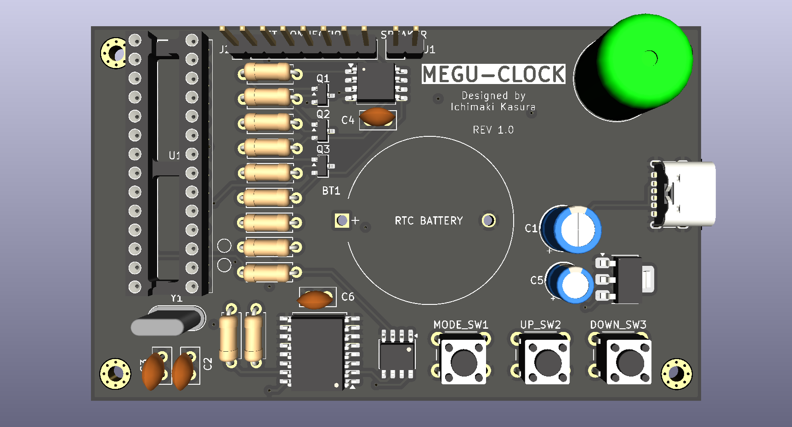

 - TEST 1
    - First version, very simplified.
    - Lack power filtering on 3.3 rail
    - Tons of TH transistors
    - wrong crystal model lmao
    - Goofy low level shifter
    - Simple RC Low Pass Filter
---
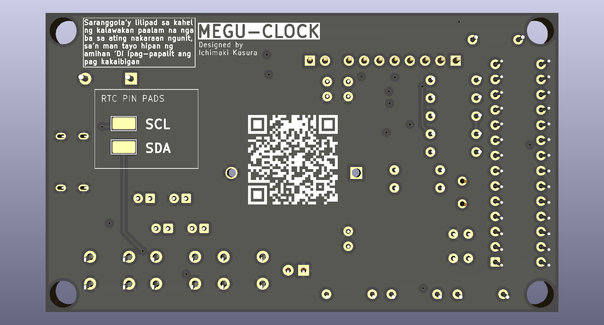
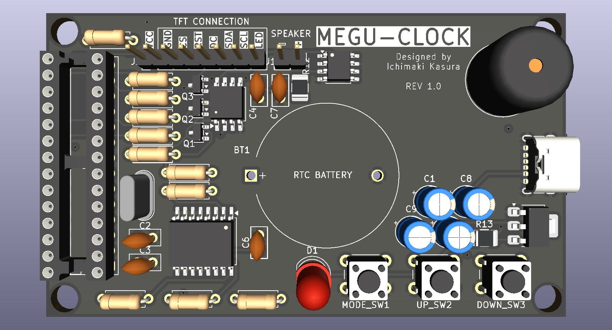

- TEST 2
    - Fixed the 3.3v filtering
    - Fixed RC Low Pass Filter
    - Added LED pwr indicator
    - Added RTC's SCL,SDA Pads for programming? (this is wrong btw, lacks CS)
    - Replaced 2 transistors with SMD onces
    - TFT pin header texts are in front
    - Still, goofy Logic level shifter
---
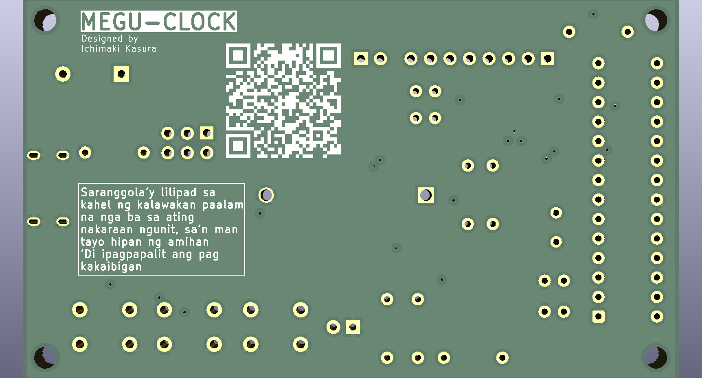
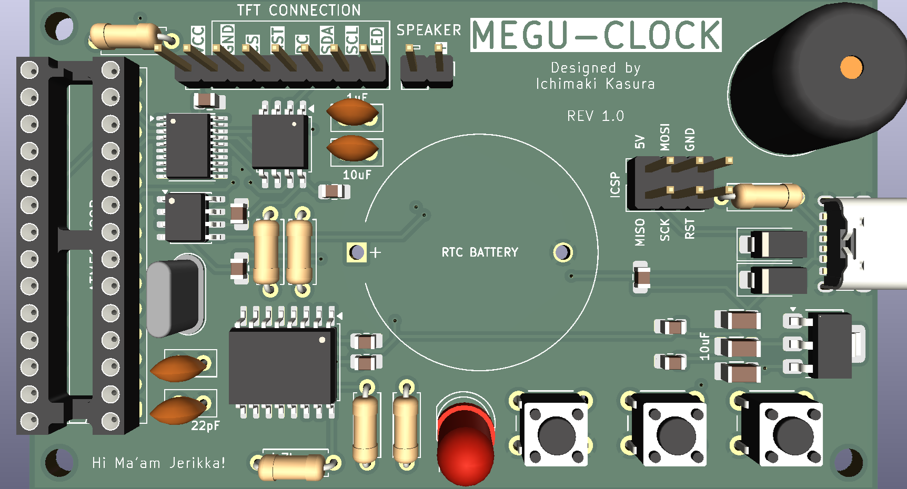
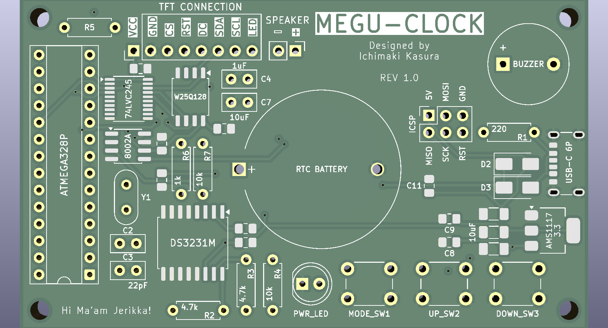

- TEST 3
    - Uses SMD Components more. (Rip to my future self soldering them)
    - Added Backflow protection (cuz of ICSP)
    - Added ICSP connection
    - Used better Logic Level Shifter (Reduced tons of transistors)
    - Added Decoupling Capacitor
---
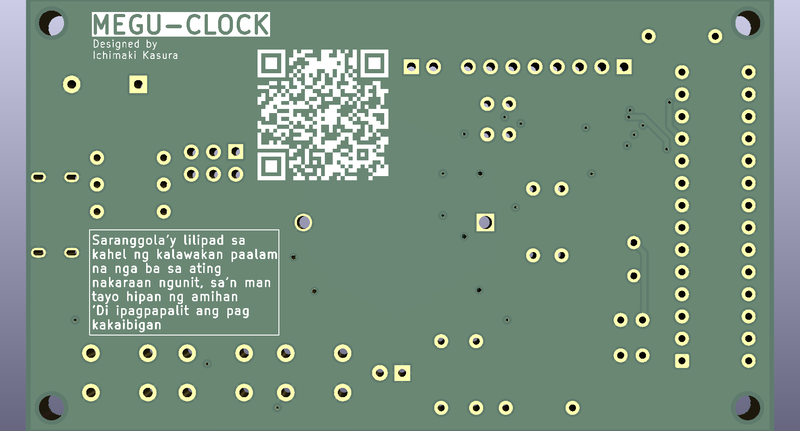
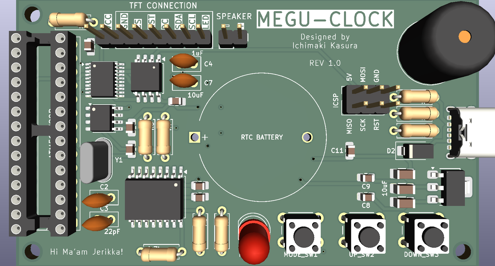
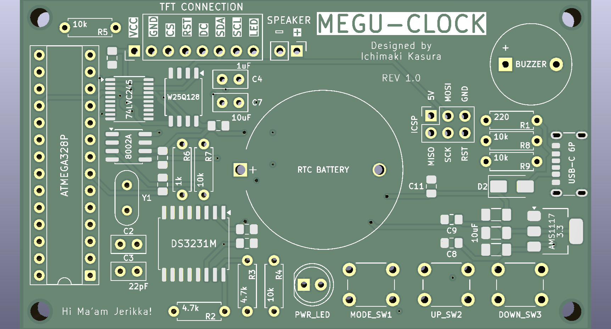

- TEST 4
    - Removed extra schottky diode
    - Added two resistor (keeps CS pins LOW)
---

`[Forgot to screenshot but this 5th test was the one sent to be created]`

- TEST 5
    - Power Traces widen to 1mm
    - Fixed some Traces (Used auto tracer but fixed long traces)

## [REVISION 2]

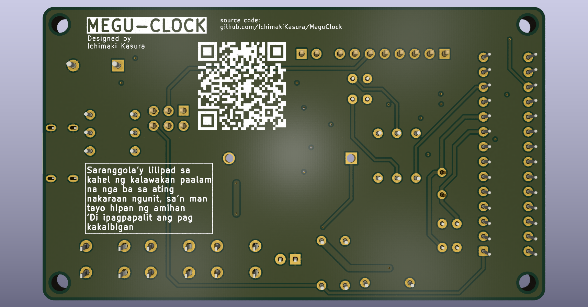
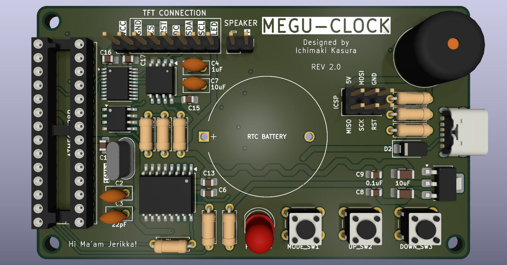
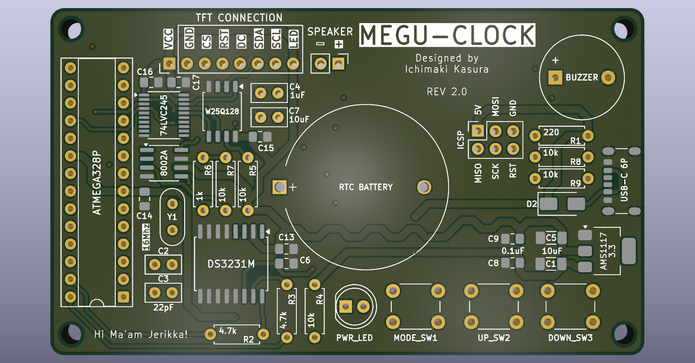

- TEST 1
    - Fixed decoupling placement (2-5mm max).
    - Added source code silkscreen at bottom.
    - Reduced 2 capacitors.
    - Removed decoupling on 8002A as spreadsheet it requires no longer.
    - manually traced the top and bottom, leaving the 2nd and 3rd layer for free routing (auto route).
    - Board is now rounded
---

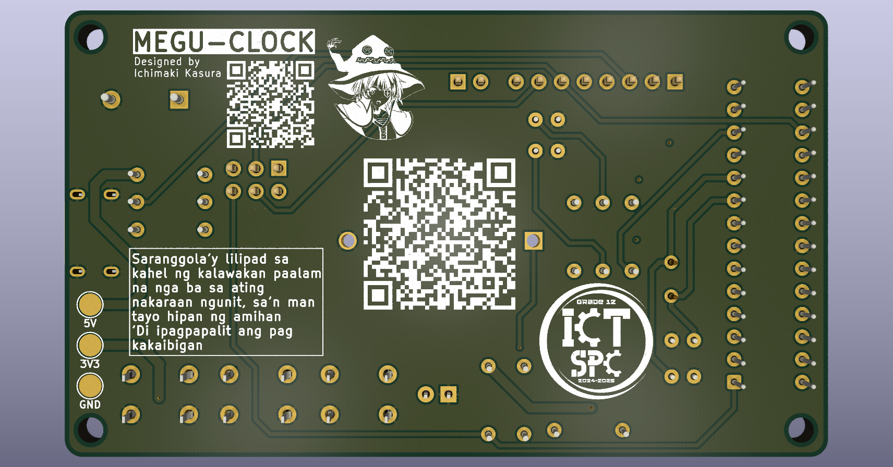
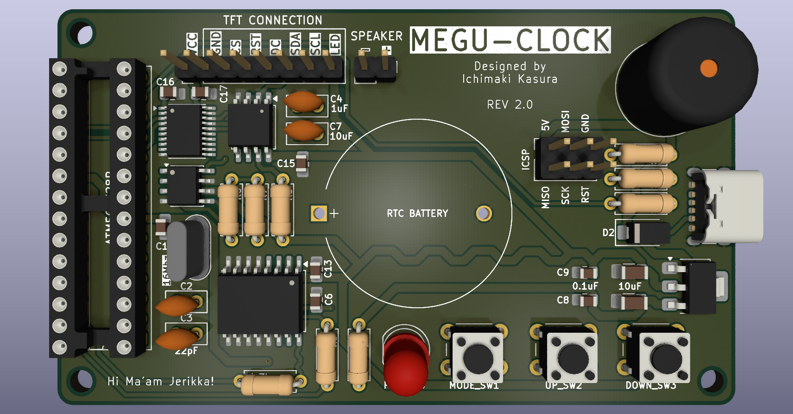
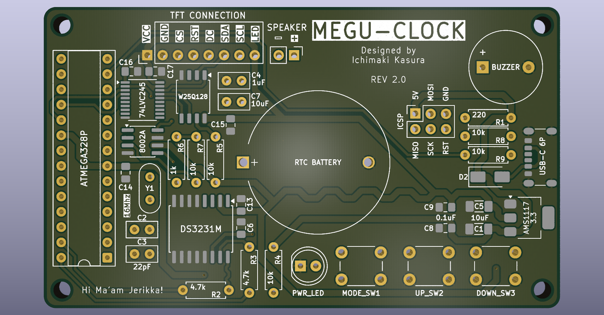

- TEST 2
    - Reduced via holes
    - Added vcc's test pads idfk
    - Added more silkscreens (lmao)
    - Optimized Traces??

Materials/Components:
- ATMEGA328P
- W25Q128
- 74LVC245
- 8002A (audio amp)
- DS3231M
- CR2032 HOLDER
- PASSIVE BUZZER
- USB-C 6P
- AMS1117 3.3
- LED
- 3PCs TACTILE BUTTON
- 8P HEADER
- 2X3P HEADER OR 2PC 3P HEADER?
- 2P HEADER
- 220 RESISTOR
- 1K RESISTOR
- 2PCs 4.7K RESISTOR
- 5PCs 10K RESISTOR
- SS14 DIODE
- 2PCs 22pF RADIAL CERAMIC CAPACITOR
- 8PCs 100nF/0.1uF SMD CAPACITOR
- 1uF RADIAL CERAMIC CAPACITOR
- 10uF RADIAL CERAMIC CAPACITOR
- 2PCs 10uF SMD CAPACITOR
- 16MHZ CRYSTAL