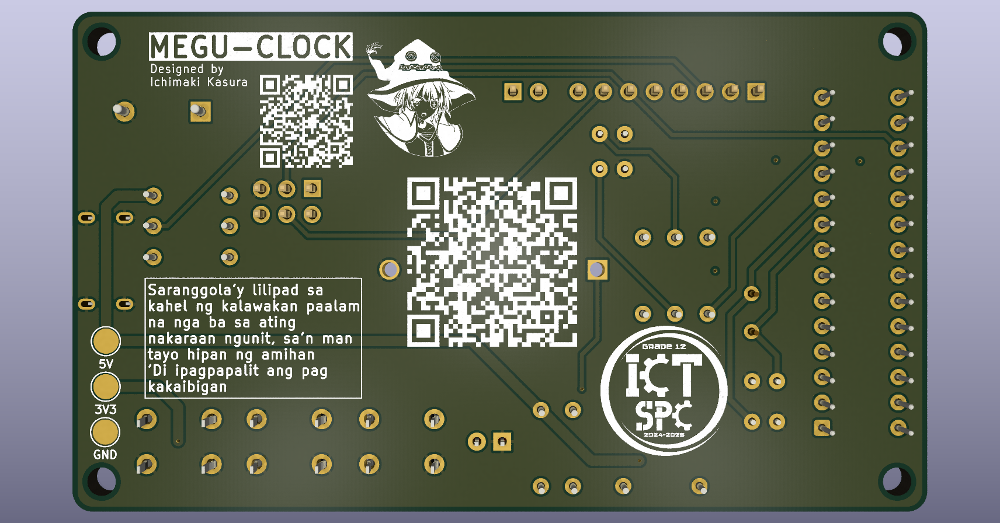
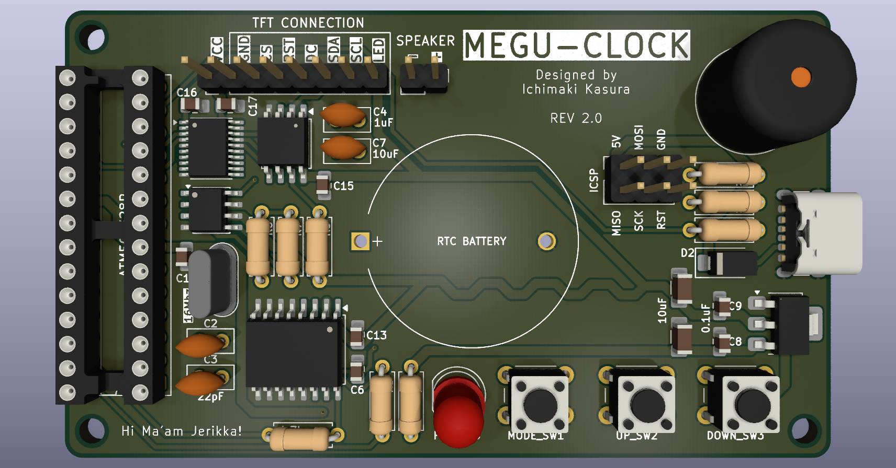
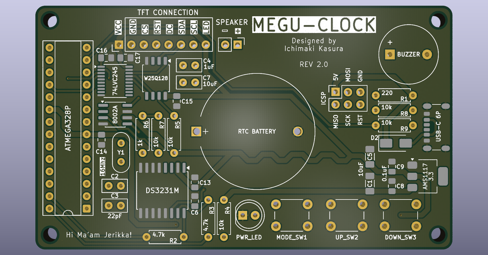
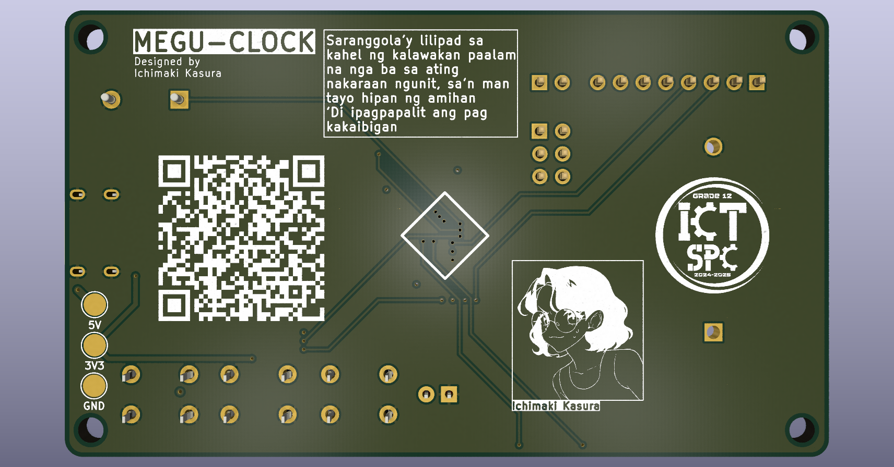
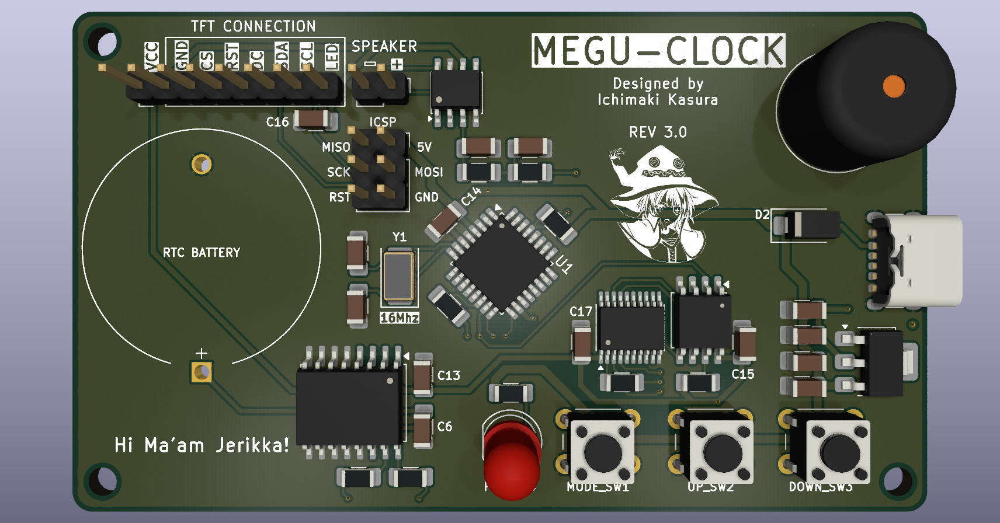
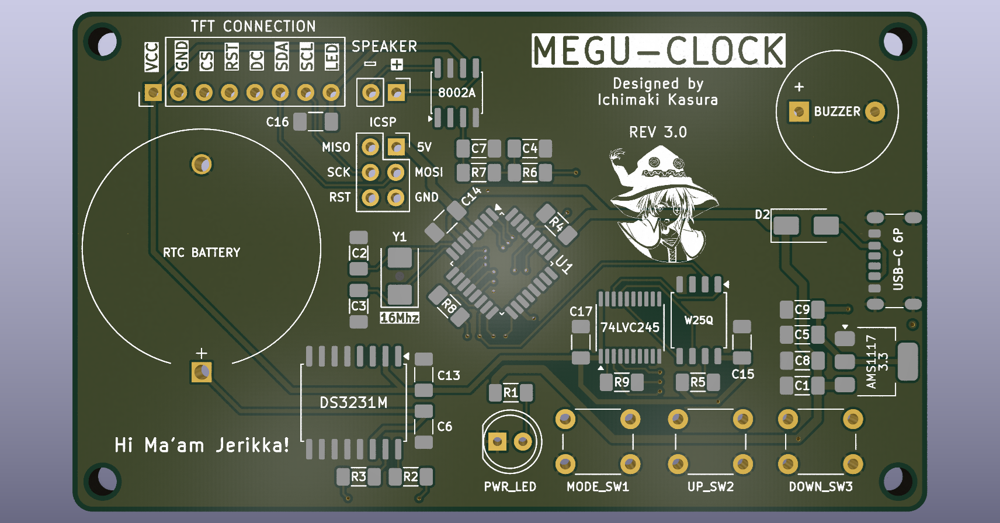
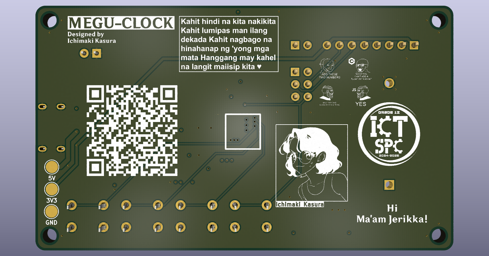
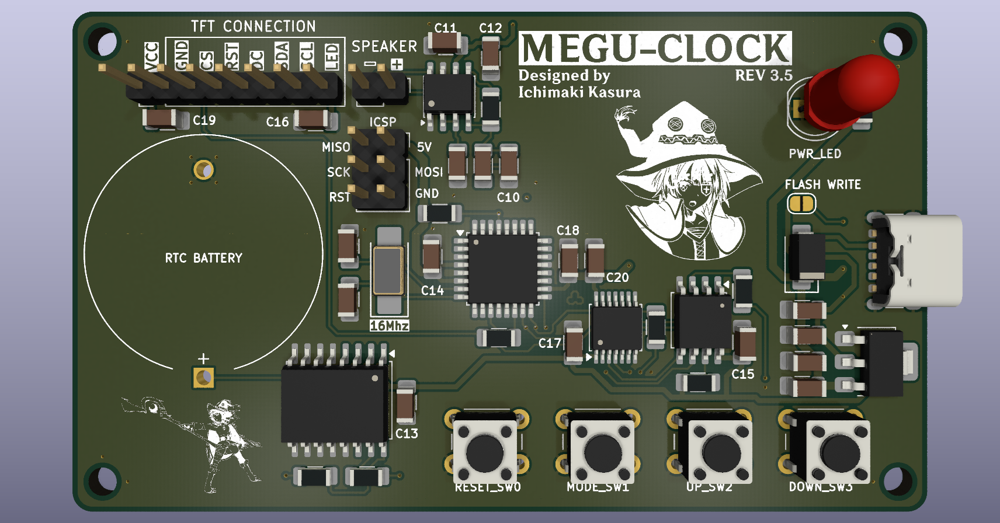
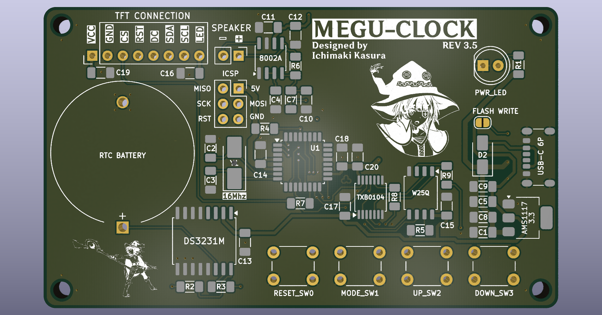

# MeguClock product?

In this project, I'll try to learn how to design PCB and reverse engineer the connections of the components.

What I've learned when making this project:

1. Logic Level Shifter (ts makes my head hurt)
2. Power filtering (High, Low Frequency)
3. Decoupling?!?
4. RC Low Pass Filter lmao

## [REVISION 1]
tests:

 - TEST 1
    - First version, very simplified.
    - Lack power filtering on 3.3 rail
    - Tons of TH transistors
    - wrong crystal model lmao
    - Goofy low level shifter
    - Simple RC Low Pass Filter
---

- TEST 2
    - Fixed the 3.3v filtering
    - Fixed RC Low Pass Filter
    - Added LED pwr indicator
    - Added RTC's SCL,SDA Pads for programming? (this is wrong btw, lacks CS)
    - Replaced 2 transistors with SMD onces
    - TFT pin header texts are in front
    - Still, goofy Logic level shifter
---

- TEST 3
    - Uses SMD Components more. (Rip to my future self soldering them)
    - Added Backflow protection (cuz of ICSP)
    - Added ICSP connection
    - Used better Logic Level Shifter (Reduced tons of transistors)
    - Added Decoupling Capacitor
---

- TEST 4
    - Removed extra schottky diode
    - Added two resistor (keeps CS pins LOW)
---

`[Forgot to screenshot but this 5th test was the one sent to be created]`

- TEST 5
    - Power Traces widen to 1mm
    - Fixed some Traces (Used auto tracer but fixed long traces)

## [REVISION 2]

- TEST 1
    - Fixed decoupling placement (2-5mm max).
    - Added source code silkscreen at bottom.
    - Reduced 2 capacitors.
    - Removed decoupling on 8002A as spreadsheet it requires no longer.
    - manually traced the top and bottom, leaving the 2nd and 3rd layer for free routing (auto route).
    - Board is now rounded
---

- TEST 2
    - Reduced via holes
    - Added vcc's test pads idfk
    - Added more silkscreens (lmao)
    - Optimized Traces??

---

- TEST 3
    - Optimized the traces (reduced bends on signal lines)

## [REVISION 3]

- TEST 1
    - Used ATmega328's smd chip no longer dip chip.
    - Hand traced, no more auto trace lmao.
    - Decouplings are now fixed, close as it can be.
    - Capacitors and resistors now uses same sizes (1206).
    - Resistors are now smd, no more THT, same as the radial caps.
    - Removed THT near USB for easy heat pad.
    - Fixed 16Mhz Crystal's footprint (accidentally used HC52 instead of HC49)
    - Corrected some track width on power rails
        - 0.8mm for 5v lines (1mm was kinda overkill for both 5v and 3v)
        - 0.6 for 3.3v lines
        - 0.2mm for normal signal lines

## [REVISION 3.5]

- TEST 1
    - Fixed the very fatal mistake on the past revisions.
        - Don't use the rev 2,3 as it imposes a very fatal wrong wiring though not really fatal but the DI and DO on the Flash chip (W25Q) is accidentally swapped. Swapping these wiring will fix it.
        - Might no longer use 74LVC245 and use the TXS0108 instead since the 74LVC245 is one directional as TXS0108 is bi-directional.
        - Fixed SDA and SCL was swapped on RTC.
        - Fixed Amplifier connections, got too much RC filtering + wrong wiring.
        - removed extra decouple on RTC battery.
    - Decouplers are 1-3mm closer to the ic's.
    - Removed Buzzer.
    - Added reset switch.

| BILLS OF MATERIALS |                  |                        |                 |
|--------------------|------------------|------------------------|-----------------|
| **REV**            | **REF**          | **NAME**               | **QTY PER BRD** |
| REV 2              | CANCELLED        | CANCELLED              | CANCELLED       |
|                    |                  |                        |                 |
| REV 3              | CANCELLED        | CANCELLED              | CANCELLED       |
|                    |                  |                        |                 |
| REV 3.5            | C1,C5,C7         | 10uF (SMD1206)         | 3               |
|                    | C1,C5,C11        | 10uF (SMD1206)         | 3               |
|                    | C2,C3            | 22pF (SMD1206)         | 2               |
|                    | C10              | 1uF (SMD1206)          | 1               |
|                    | C4,C7-9,C12-20   | 100nF (SMD1206)        | 12              |
|                    | D2               | SS14 DIODE             | 1               |
|                    | R2,R3            | 4.7k ohms (SMD1206)    | 2               |
|                    | R1,R4-5,R7-9     | 10k ohms (SMD1206)     | 6               |
|                    | R6               | 100k ohms (SMD1206)    | 1               |
|                    | U1               | ATmega328-A (SMD)      | 1               |
|                    | U2               | AMS1117-3.3            | 1               |
|                    | U3               | DS3231M                | 1               |
|                    | U4               | 8002A                  | 1               |
|                    | U5               | W25Q64                 | 1               |
|                    | U7               | TXB0104                | 1               |
|                    | Y1               | 16mhz (SMD5032)        | 1               |
|                    | USBC1            | USB-C 6P               | 1               |
|                    | SW               | 4P TACT SWITCH 6x6x5   | 4               |
|                    | J1               | 2P HEADER              | 1               |
|                    | J2               | 8P HEADER              | 1               |
|                    | J3               | 2x3P HEADER            | 1               |
|                    | BT1              | CR2032 HOLDER          | 1               |
|                    | D1               | LED                    | 1               |