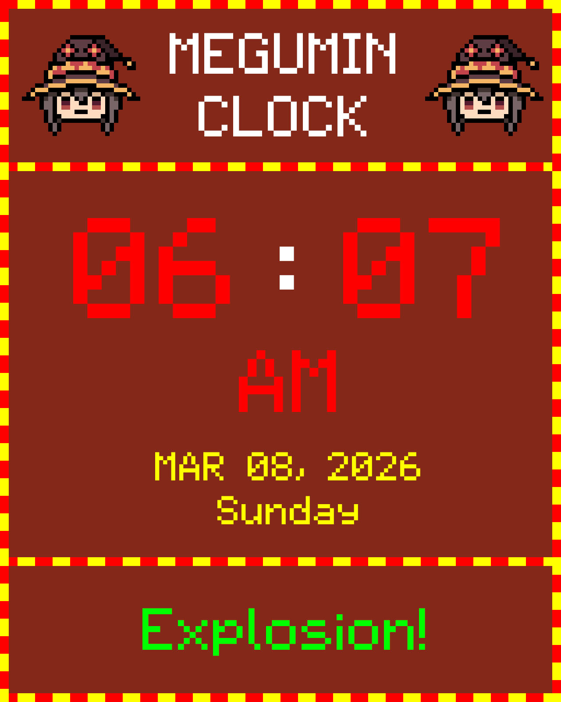

<div align="center">

# MEGU-CLOCK
*Its my goofy digital clock with funi features.*



## Features:
</div>

- Fake loading because god knows its just a simple mcu.
- Customizable uh colors
- Clock can be adjusted using 2 buttons
- Added shitty buzzer to uh for alarm idfk.
- Alarms are preloaded/hardcoded? idfk lmao
    - 6:00 AM `FNAF`
    - 10:00 AM `Samsung Morning Flower`
    - 12:00 PM `Winchester Chime`
    - 3:00 PM `Winchester Chime`
    - 10:00 PM `Short ahh Twinkle star smh`
- Has random ahh messages every 10 seconds at the bottom. *(can be customized through code ofc)*
- Has an epic border.
- Uses only 65%? of program storage space whaaat? idfk.
<div align="center">

## requirements?
</div>

- Arduino Uno/Nano (planning to upgrade to esp32 for faster shit? no more memory for goofy pictures)
- 2 Push Buttons
- Passive Buzzer
- mini DS3231 (the one says "FOR PI" even tho I used it on arduino 😈) *(Due to modified rtclib, Specifically DS3231)*
- ST7735 1.8" 128x160 (tho planning to upgrade to larger one) *(Due to modified gfx, Specifically GREEN TAB)*

wirings:
- nah you read the sht and fcken guess it by urself.

Run:
- do `bin/ao -v` or `bin/s_ao -v` for verify and `bin/ao -u` or `bin/s_ao -u` to upload to the nearest comport. _(can be modified on ao.cpp)_
    - _(s_ao.exe is a static build while ao.exe is built without linked libraries)_

# More about
- Fully independent, doesn't require other heavy ahh libraries as I've scrap most of unused shits and make a new out of it.
```bash
Used library                      Version
Modified DS3231 for MEGU-CLOCK    0.6.7   
Wire                              1.0     
Modified ST7735 for MEGU-CLOCK    0.6.7   
SPI                               1.0     
EEPROM                            2.0     
```
- `Wire`, `SPI`, `EEPROM` are literally built-in

_Feel free to use my modified [library](https://github.com/IchimakiKasura/MeguClock/tree/main/MeguClock%20(Libraries))_